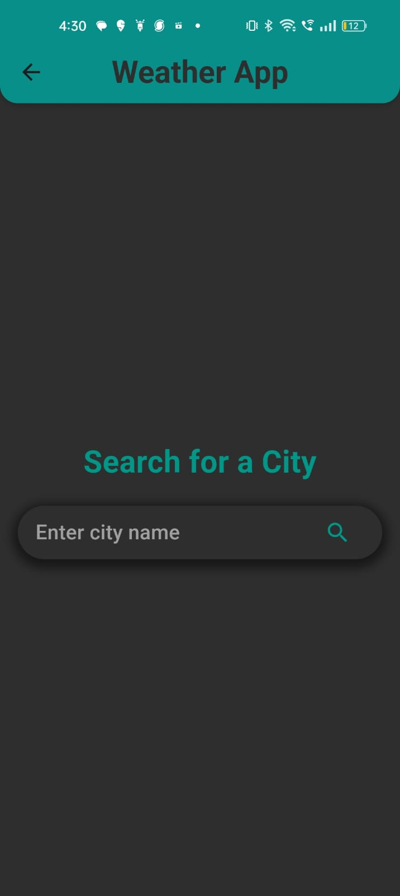

### Weather App

#### Overview

This Flutter application provides current weather information for any city using the OpenWeatherMap API. It includes features such as searching for weather by city name, displaying detailed weather information, and saving the last searched city for quick access.

#### Features

- **Home Screen:**
  - Search for weather by city name.
  - Display loading indicator during data fetching.
  - Dark-themed UI for better readability.

- **Weather Details Screen:**
  - Display detailed weather information including temperature, weather condition, humidity, and wind speed.
  - Refresh button to update weather data.
  - Consistent dark-themed UI.

- **Get Started Page:**
  - Introduction to the Weather App with a sunny icon and welcoming message.
  - Teal color theme for branding.

#### Video Preview

Here's a short video demonstrating the Get Started page and its animations:

[

Replace `screenshots/get_started_animation.gif` with the path to your video file (assuming it's in the `screenshots` folder).

#### Screenshots

- 
- 

#### Installation

### Prerequisites

- Flutter SDK installed ([installation guide](https://flutter.dev/docs/get-started/install))

#### Steps

1. **Clone the repository:**

   ```bash
   git clone https://github.com/your_username/weather_app.git
   cd weather_app
    ```
2.  **Install dependencies**
   ```bash
   flutter pub get
   ```
3. Run the app:

Ensure your device/emulator is connected and run:

```bash
flutter run
```
This command will build and install the app on your connected device/emulator.


   
